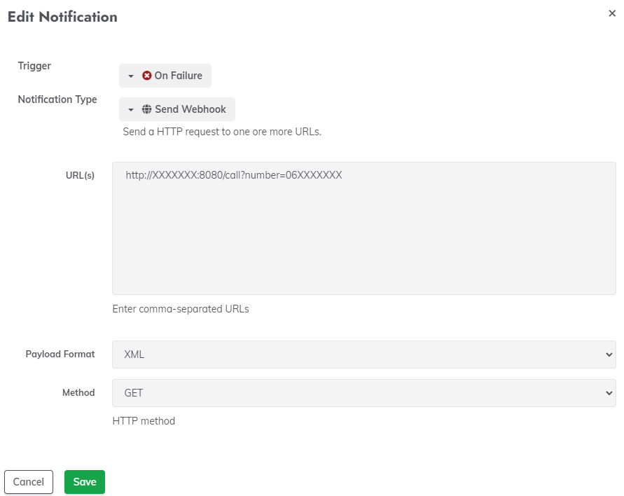
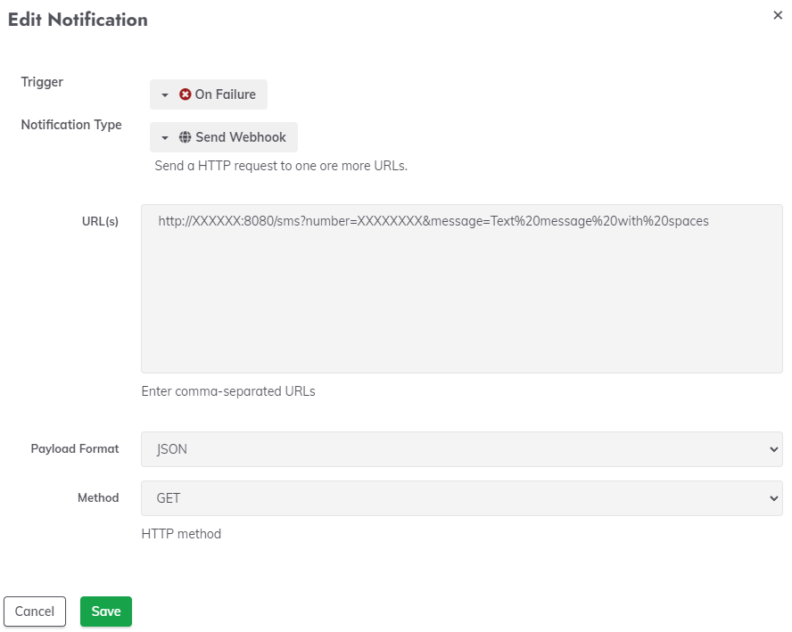
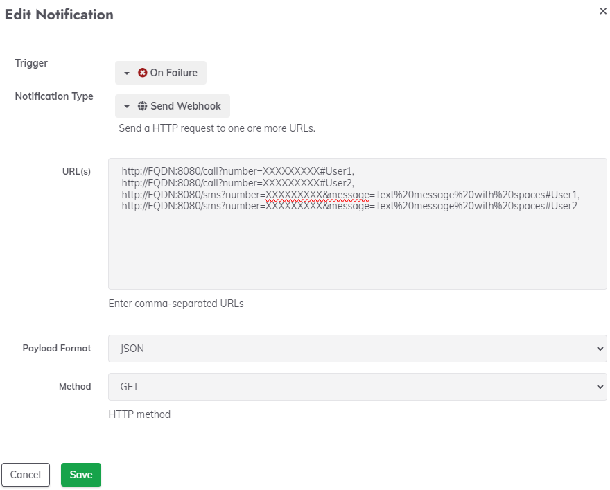

# Rundeck

!!! info "It is important to select **Method** to be `GET`, while **Payload Format** doesn't matter." 

___

## Call

`http://FQDN:8080/call?number=XXXXXX`

 

___

## SMS

`http://FQDN:8080/sms?number=XXXXXX&message=Text%20message%20with%20spaces`

 

!!! info "Since we can't manipulate Webhook arguments, this is required format to submit SMS message to API." 


___

## Multiple alerts within single notification

Rundeck accepts multiple lines/URLs within Notification, which are separated with comma `,`.

Example:

```powershell

http://FQDN:8080/call?number=XXXXXXXXX#User1,
http://FQDN:8080/call?number=XXXXXXXXX#User2,
http://FQDN:8080/sms?number=XXXXXXXXX&message=Text%20message%20with%20spaces#User1,
http://FQDN:8080/sms?number=XXXXXXXXX&message=Text%20message%20with%20spaces#User2

```

!!! info "You can also add comments e.g #User1 to distinguish which number corresponds to which person."

 


