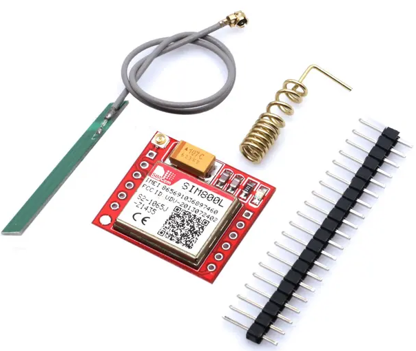
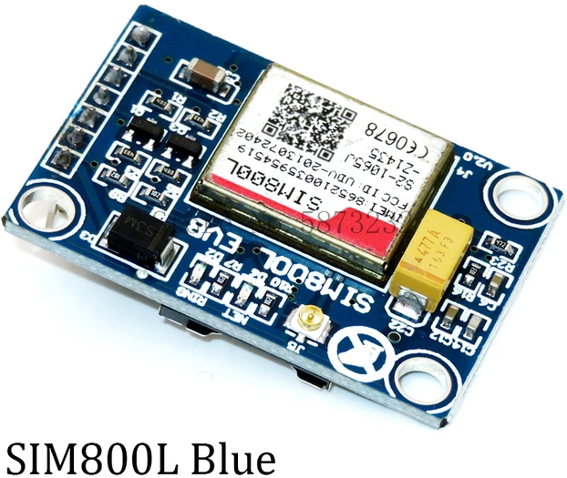
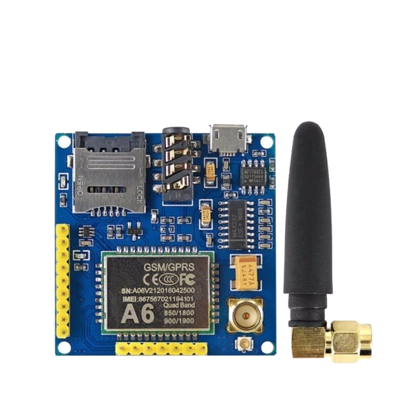
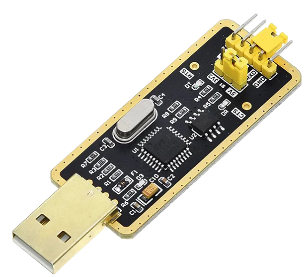
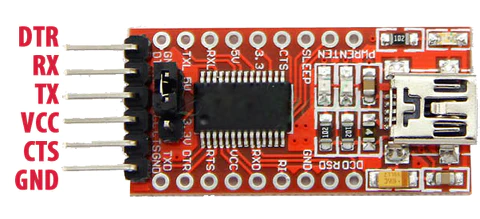

# GSM

### Supported and tested devices: 

|                               Device                                |           URL            |     Device need 2A power or Capacitor      | `CSCS="UCS2"` (UTF8 Support): | Read SMS Support: |
| ------------------------------------------------------------------- | ------------------------ | ------------------------------------------ | ----------------------------- | ----------------- |
| SIM800L   (RECOMMENDED)                | https://archive.is/oS4Tp | ✅     [More info](./wiringsim800l.md)      | ✅                             | ✅                 |
| SIM800L Blue   (RECOMMENDED) | https://archive.is/SG3lx | ✅     [More info](./wiringsim800l-blue.md) | ✅                             | ✅                 |
| A6 GPRS Pro             | https://archive.is/ZP2cn | ❌     [Direct Wiring](./wiringa6.md)       | ❌                             | ❌                 |
___

# USB to TTL serial adapter

### Supported and tested devices: 

| Device                                    | URL                                    |
|-------------------------------------------|----------------------------------------|
|  | https://archive.is/agEjj (RECOMMENDED) |
|              | https://archive.is/BZiJ3               |

___

!!! info "More devices will be added when tested." 


