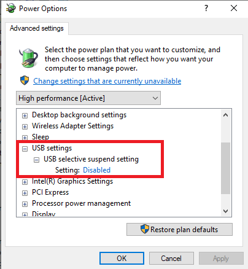
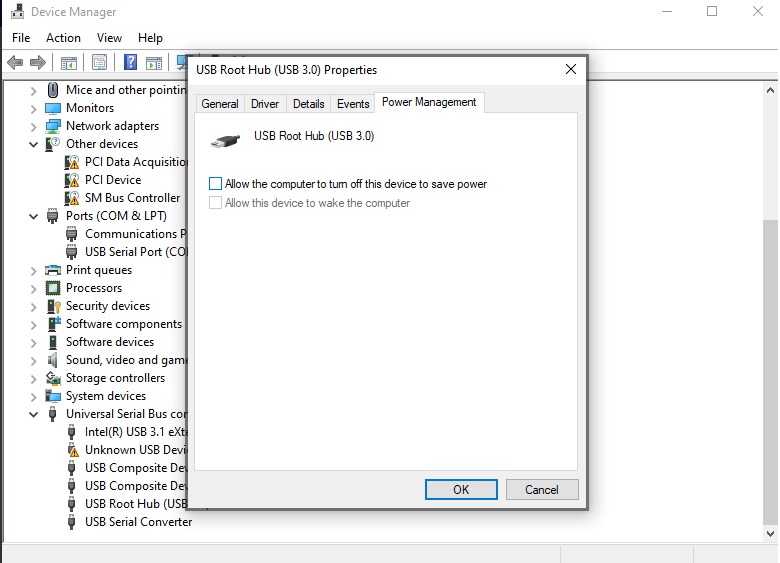

---
hide:
  - toc
---
# Troubleshooting

Various permissions errors can be solved with following code block on Linux, if you are running project as different user than root:

!!! info "Replace `YourUsername`" 

```bash
sudo usermod -a -G tty YourUsername
sudo usermod -a -G dialout YourUsername
```
___

# Troubleshooting USB device power managment:

## Linux

Linux might have USB power manager which could disable USB2TTL adapter. To disable USB power management on boot append following cronjob to **crontab** by issuing command `crontab -e`:
!!! Solution
    ```bash
    @reboot if grep -Fxq "2" /sys/module/usbcore/parameters/autosuspend ; then echo -1 > /sys/module/usbcore/parameters/autosuspend;fi
    ```
___

## Windows

- On Windows it is mandatory to disable `USB selective suspend setting` in Power Options (`Control Panel\All Control Panel Items\Power Options\Edit Plan Settings`), to prevent OS from disabling USB device after some time.



- Also, in **Device Manager** disable `Allow the Computer to turn off this device to save power` for `USB Hub`/`USB Root Hub` to which your device is connected.


___

