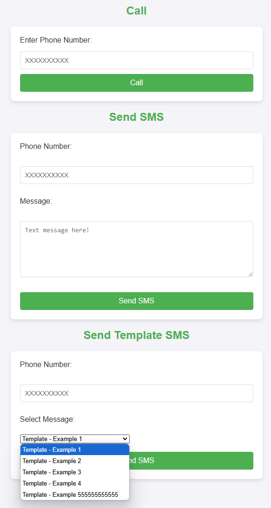

# Web

Visit http://IP:8080 or http://FQDN:8080

Following forms will submit requests to [API](api.md).

**Note**: JS script on the page will set the action URL of the forms dynamically to the current browser URL.

