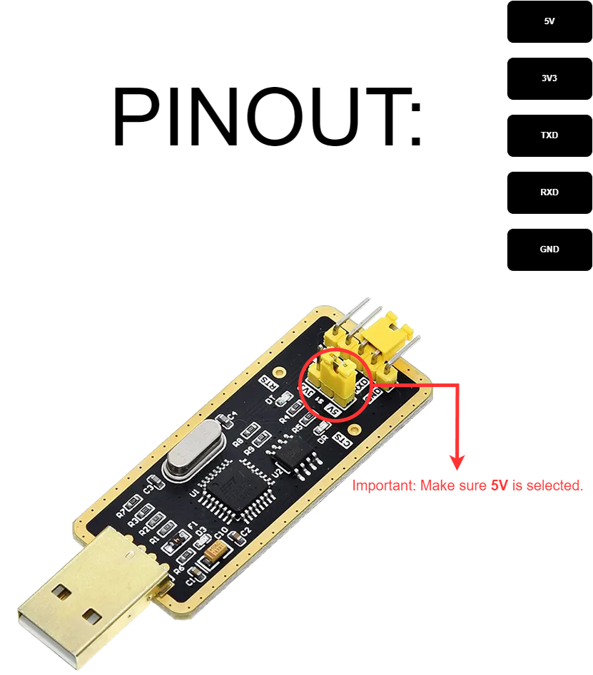

# Wiring SIM800L Blue

!!! danger "Make sure to switch to 5V on USB2TTL serial adapter" 

## Wiring USB2TTL

| VCC | to | VCC |
|:---:|:--:|:---:|
| GND | to | GND |
| RX  | to | TX  |
| TX  | to | RX  |

___

## Additional power information

!!! danger "IMPORTANT!!!" 

- SIM800L needs external power supply 5V/2A
- This can be bypassed with capacitor 16V 2200uF and provide stability during Calls & SMS due to higher power draw.
    - !!! danger "Soldering could be dangerous due to high heat 🔥 and fume exhausts 💨, so if unsure how to do it properly you could ask local repair shop to do it for you!"

## Capacitor Wiring

| VCC | to | VCC |
|:---:|:--:|:---:|
| GND | to | GND |

## TODO

- Diagram
- Pictures with capacitor
!!! note "Can't find good image online, refer to [Wiring SIM800L](./wiringsim800l.md) temporally." 


