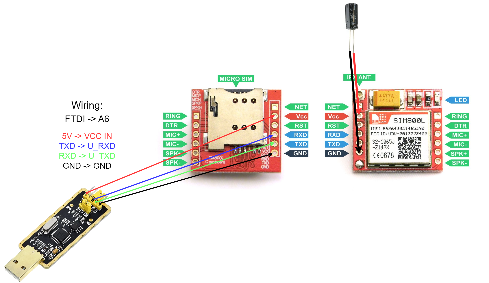

# Wiring SIM800L

!!! danger "Make sure to switch to 5V on USB2TTL serial adapter" 

## Wiring USB2TTL

| VCC | to | VCC |
|:---:|:--:|:---:|
| GND | to | GND |
| RX  | to | TX  |
| TX  | to | RX  |

___

## Additional power information

!!! danger "IMPORTANT!!!" 

- SIM800L needs external power supply 5V/2A
- This can be bypassed with capacitor 16V 2200uF and provide stability during Calls & SMS due to higher power draw.

## Capacitor Wiring

| VCC | to | VCC |
|:---:|:--:|:---:|
| GND | to | GND |


